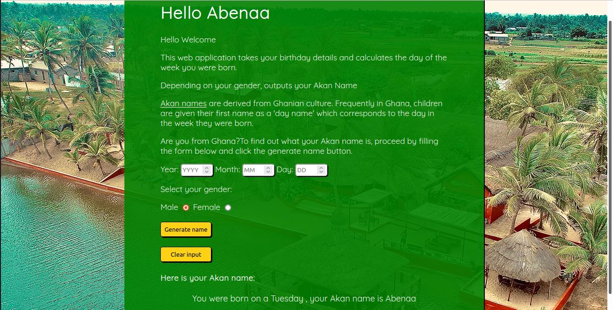
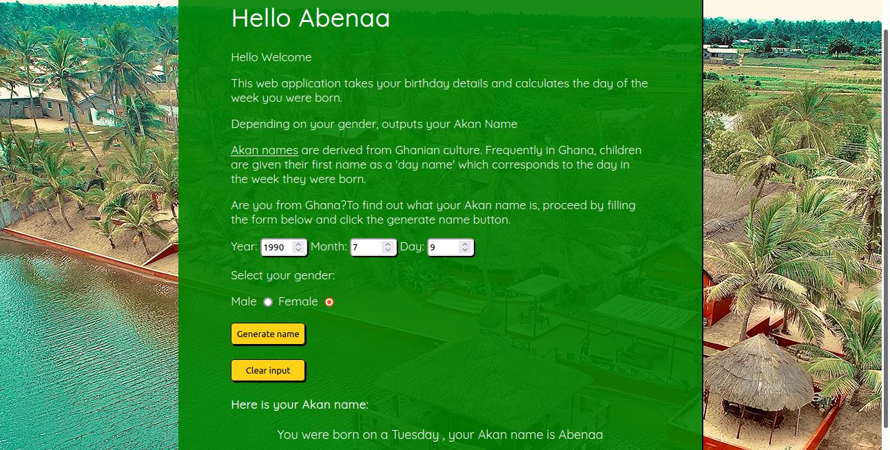
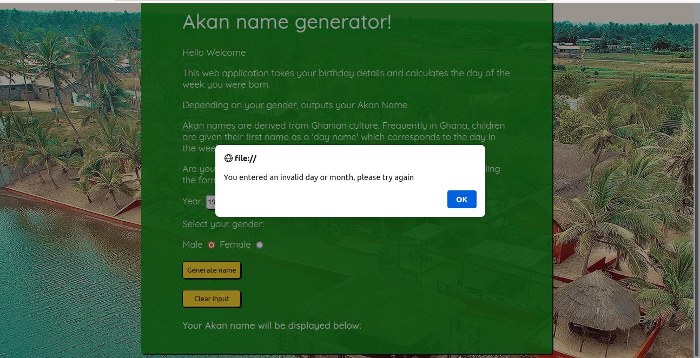

# Akan name generator
#### A web app that generates  Akan names based on the date of birth and gender by determining the day you were born.

## Author
Maxwell Munene

## Versioning
Akan name generator!

This is a web application that takes a user's birthday and calculates the day of the week they were born and then depending on their gender outputs their Akan Name.

Akan names are derived from Ghanian culture. Frequently in Ghana, children are given their first name as a 'day name' which corresponds to the day in the week they were born. Here are Ghanian day names.

#Male.

>Sunday: Kwasi

>Monday: Kwadwo

>Tuesday: Kwabena

>Wednesday: Kwaku

>Thursday:  Yaw

>Friday: Kofi

>Saturday: Kwame

##Female

>Sunday: Akosua

>Monday: Adwoa

>Tuesday: Abenaa

>Wednesday: Akua

>Thursday:  Yaa

>Friday: Afua

>Saturday: Ama

## Features
Here are the features in summary:
* Input of year of birth.
* Input month of birth.
* Input day of birth.
* Select Gender.
* Output Akan name.

## Known Bugs
* Formula provided to determine day of birth shows inconsistency in its results (Bug fixed)
## Technologies Used
* HTML  
* CSS
* Javascript

## Support and contact details
You can provide feedback or raise any issues/ bugs through the following means:
* maxwell.munene@student.moringaschool.com

## License
#### *MIT License*
The MIT License

Permission is hereby granted, free of charge, to any person obtaining a copy
of this software and associated documentation files (the "Software"), to deal
in the Software without restriction, including without limitation the rights
to use, copy, modify, merge, publish, distribute, sublicense, and/or sell
copies of the Software, and to permit persons to whom the Software is
furnished to do so, subject to the following conditions:

The above copyright notice and this permission notice shall be included in
all copies or substantial portions of the Software.

THE SOFTWARE IS PROVIDED "AS IS", WITHOUT WARRANTY OF ANY KIND, EXPRESS OR
IMPLIED, INCLUDING BUT NOT LIMITED TO THE WARRANTIES OF MERCHANTABILITY,
FITNESS FOR A PARTICULAR PURPOSE AND NONINFRINGEMENT. IN NO EVENT SHALL THE
AUTHORS OR COPYRIGHT HOLDERS BE LIABLE FOR ANY CLAIM, DAMAGES OR OTHER
LIABILITY, WHETHER IN AN ACTION OF CONTRACT, TORT OR OTHERWISE, ARISING FROM,
OUT OF OR IN CONNECTION WITH THE SOFTWARE OR THE USE OR OTHER DEALINGS IN
THE SOFTWARE.

Copyright (c) 2021 **Maxwell Munene**
